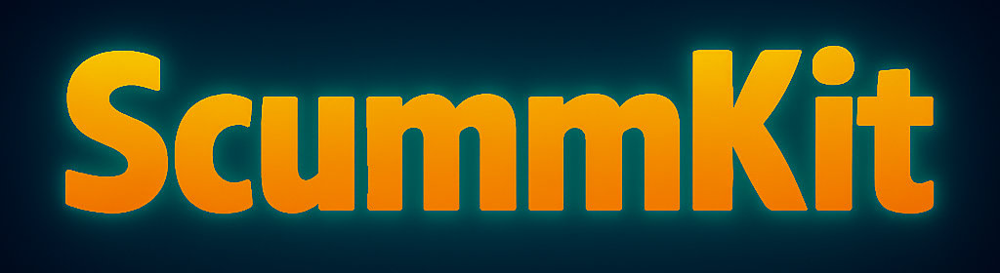

<!-- Banner (add profile/banner.png in this repo) -->

  

<h1 align="center">👾 ScummKit</h1>

  Reviving the legendary SCUMM engine — rebuilt with modern tools for a new era.

  
  
  
  
  

---

**ScummKit** is an open‑source toolkit and modern compiler for the classic SCUMM adventure game system.  
Our mission is to make it easy to build, play, and preserve story‑driven point‑and‑click adventures.

- ⚡ **Modern SCUMM compiler** (currently focused on **v5**)
- 🕹️ **Tools** for rooms, objects, scripts; clean‑room reimplementation for learning & preservation
- 🎓 **Great for devs & researchers**: compilers, VMs, and language design, in the open

### What’s working now
- ✅ **ScummViewer** — browse SCUMM v4/v5 (rooms, images, costumes, sound, charsets, scripts) with export tools; experimental decompiler (subset).
- 🧩 **Compiler v5 (CLI)** — compiles SCUMM/Marley subsets for verification; debug views (no full runtime yet).
- ⚙️ **VM (prototype)** — stepping/verification sandbox in progress; full runtime planned.
- 🌱 **Marley language** — modern SCUMM‑style scripting (design phase) with togglable SCUMM ↔ Marley compilation.

> SCUMM is a trademark of Lucasfilm Games. ScummKit is a fan‑led, clean‑room reimplementation for preservation and learning.

---

### Get involved
- 📚 Docs & code: **[Monorepo](https://github.com/VicentinaStudios/ScummKit)**
- 💬 Community: **[Discussions](https://github.com/VicentinaStudios/ScummKit/discussions)** · **[Discord](https://discord.gg/VxwxvW93)**
- ❤️ Support: **[Patreon](https://patreon.com/scummkit)** · **[GitHub Sponsors](https://github.com/sponsors/scummkit)**

---

  Made by <a href="https://www.vicentinastudios.com/">Vicentina Studios</a> · <a href="https://www.michaelborgmann.com/">Michael Borgmann</a>

